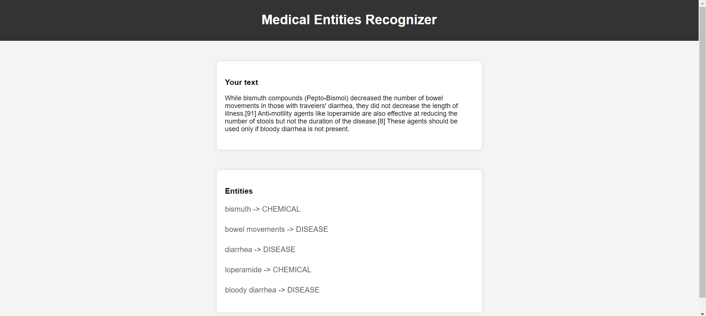

# Custom NER Model for Medical Terms

This project is a web application that leverages NLP (Natural Language Processing) Techniques to identify and extract medical entities from a given text. It uses Named Entity Recognition (NER) to automatically identify and classify named entities in medical languages such as medicines, diseases, etc.

###### Note: Could not host the web app online due to high size of model but you can train the model on your local machine and use it. The instructions are here. I have also added Screenshots of the App.

## Table of Contents

- [Screenshots](#screenshots)
- [Installation](#installation)
- [Usage](#usage)
- [Contributing](#contributing)
- [License](#license)

## Screenshots




## Installation

### Prerequisites

- Python 3.8 or higher
- [Spacy](https://spacy.io/)
- [Flask](https://flask.palletsprojects.com/en/3.0.x/)

### Steps

1. Clone the repository:

   ```bash
   git clone https://github.com/devesht21/NER-Model-for-Medical-Terms
   cd NER-Model-for-Medical-Terms

   ```

2. Create a virtual environment:

   ```bash
   conda create -p venv python==3.8.0 -y
   conda activate venv

   ```

3. Install the required packages:

   ```bash
   pip install -r requirements.txt

   ```

4. Train the model by running NER - Medical Terms.ipynb file

5. Run the app.py file

   ```bash
   python app.py
   ```

## Usage

You can use the provided code and data to train your own custom NER models on different types of text data. The notebook provides detailed explanations and code comments to help you understand each step of the process.

## Contributing

Contributions are welcome! Please fork the repository and submit a pull request for review.

1. Fork the repository.
2. Create your feature branch (git checkout -b feature/AmazingFeature).
3. Commit your changes (git commit -m 'Add some AmazingFeature').
4. Push to the branch (git push origin feature/AmazingFeature).
5. Open a pull request.

## License

This project is licensed under the MIT License - see the [LICENSE](https://choosealicense.com/licenses/mit/) file for details.
